<div align="center">
  
</div>

<br>

<div align="center">
  
</div>

<br>
---

## 👨‍💻 About Me

```javascript
const atiksh = {
  name: "Atiksh Kotikalapudi",
  education: "Purdue University - CS & AI, Minor in Business Economics",
  graduation: "Dec 2026",
  location: "📍 West Lafayette, IN",
  interests: ["AI/ML", "Full-Stack Development", "Natural Language Processing"],
  currentlyLearning: ["Advanced AI Systems", "Cloud Computing", "System Design"],
  funFact: "I can solve a Rubik's cube in under 2 minutes while debugging code! 🧊⚡",
  coffeeConsumed: "∞ cups ☕",
  bugsFixed: "Countless! 🐛➡️✨",
  motivation: "Creating AI solutions that solve real-world problems!"
};
```

## 🛠️ Tech Stack

### Programming Languages


### AI/ML & Data Science


### Frameworks & Libraries


### Databases & Cloud


### Tools & Technologies


## 🎯 Current Focus

<div align="center">
  
</div>

<br>

<div align="center">
  
</div>

## 🚀 What I'm Up To

```javascript
// My current journey in AI and development
function myJourney() {
  const currentRole = "SWE and AI Intern at ONOW Enable";
  const recentProjects = [
    "Natural Language-to-SQL Chatbot",
    "RAG Pipeline for Multi-Database Systems", 
    "Multilingual Audio Transcription & Translation"
  ];
  const building = ["AI Creative Writing Assistant", "Code Review Agent", "Advanced Compilers"];
}
```

## 🎮 Fun Facts About Me

<div align="center">
  
  
  
  
  
</div>

- 🎾 **Tennis**: Active member of Purdue Club Tennis team
- 🤝 **Volunteering**: Aceing Autism and Cause for Paws
- 🌍 **Languages**: Fluent in Hindi, Telugu, and Spanish
- 🏛️ **Leadership**: Campus tour guide helping prospective students

## 💡 Random Developer Thoughts

<div align="center">
  
  
  
</div>


## 🏃‍♂️ My Coding Journey

```mermaid
graph LR
    A[👶 Started Coding] --> B[📚 Learning Basics]
    B --> C[💻 First Project]
    C --> D[🐛 Debugging Skills]
    D --> E[🚀 Building Apps]
    E --> F[🌟 Future Goals]
    
    style A fill:#ff9999
    style F fill:#99ff99
```



## 📫 Let's Connect!

<div align="center">
  
  [](https://www.linkedin.com/in/atiksh-kotikalapudi)
  [](https://github.com/Atiksh47)
  [](mailto:atiksh.kotikalapudi@gmail.com)
  [](tel:8578915763)
  
</div>

---

<div align="center">
  
  
  
  <br>
  
  <i>Thanks for visiting my profile! Feel free to explore my repositories! ⭐</i>
  
</div>

---

<div align="center">
  
</div>